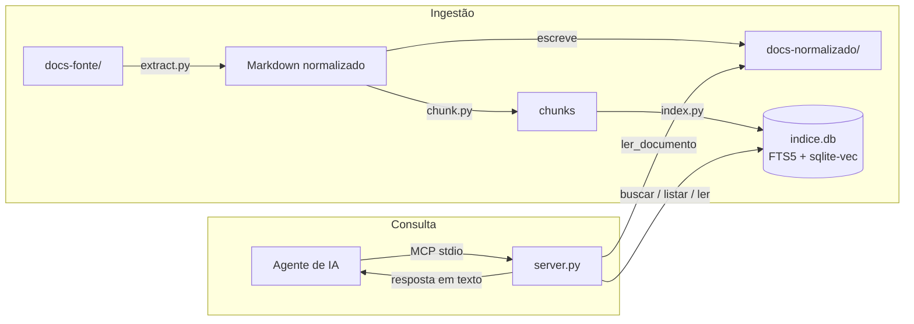

# Arquitetura

## Visão geral

## Decisões e o porquê

### SQLite FTS5 em vez de um banco vetorial dedicado

Um banco vetorial (Chroma, Qdrant, FAISS) resolveria só metade do problema —
a busca por vocabulário natural — e deixaria a busca por termo técnico exato
(nome de variável, endpoint, coluna) pior do que um BM25 simples. SQLite FTS5
já entrega BM25 de fábrica, sem subir nenhum serviço, e a extensão
`sqlite-vec` adiciona a camada vetorial **no mesmo arquivo**, sem introduzir
um segundo banco. Um projeto de documentação de "centenas de arquivos" não
justifica a complexidade operacional de um banco dedicado.

### Normalizar tudo para Markdown antes de indexar

Em vez de extrair texto direto de cada formato para dentro do índice, o
pipeline grava um Markdown intermediário em `docs-normalizado/`. Isso separa
dois problemas que, misturados, são difíceis de depurar juntos: "a extração
saiu ruim" vs. "a busca não encontrou o trecho certo". Também dá a uma
pessoa (não só ao agente) um jeito de ler a documentação diretamente.

### Ingestão incremental por sha256

A decisão original era reindexar tudo a cada ingestão. Deixou de valer com PDFs
grandes: com embeddings em CPU, o corpus local (11 documentos, ~6 mil chunks)
levava ~35 minutos, e o `docserver watch` repetia isso a cada arquivo copiado.

Hoje a tabela `arquivos` registra, por origem, o sha256, o tamanho, o número de
chunks, o extrator e a data. A ingestão calcula o sha256 de cada arquivo
suportado (dezenas de ms para um PDF de 16 MB) e classifica:

- **inalterado** (hash igual e `.md` normalizado presente): não extrai nem embedda;
- **novo ou alterado**: extrai, divide e embedda só ele;
- **removido** (indexado, mas não mantido nem reprocessado): sai do índice.

O hash, e não o `mtime`, decide porque a cópia no Windows preserva o `mtime` e
restaurar um backup antigo não o avança. Há **um único caminho de gravação**
(`index.atualizar_indice`): a reconstrução completa é o mesmo fluxo com todos os
arquivos tratados como novos e o esquema recriado antes. Ela acontece com índice
em formato antigo, modelo de embeddings diferente do registrado (que antes dava
`ErroModeloDivergente` e exigia `--limpar`) ou chunks sem vetor numa ingestão com
embeddings.

A gravação é uma transação só (`BEGIN IMMEDIATE`, `rollback` em qualquer erro):
apaga chunks, vetores e registros das origens alteradas e removidas, insere os
novos e grava os registros. Os `.md` órfãos só são apagados depois do commit. As
proteções contra esvaziar o índice usam o total final (chunks mantidos + novos).

### Busca híbrida com Reciprocal Rank Fusion (RRF)

BM25 e similaridade de cosseno vivem em escalas numéricas diferentes;
somar ou normalizar os dois scores diretamente é uma fonte constante de bugs
sutis (um dos dois passa a dominar dependendo da distribuição de valores).
RRF usa apenas a **posição** de cada resultado em cada lista, então o
problema desaparece — o preço é não conseguir combinar os scores brutos,
o que não importa aqui porque o consumidor final é um agente de IA lendo
texto, não um sistema que precisa do score exato.

RRF por si só sempre devolve `limite` resultados, mesmo quando nada no índice
é de fato relevante — ele só sabe *ordenar*, não sabe dizer "nada aqui serve".
Com dois documentos de vocabulário parecido no mesmo índice (dois PDFs
institucionais, por exemplo), isso mistura trechos de um documento na
resposta sobre o outro, sem nenhum sinal de que algo deu errado. Por isso
`buscar_hibrido` aplica um corte de relevância depois do RRF: um resultado só
sobrevive se apareceu na lista léxica **e** cobre pelo menos
`COBERTURA_LEXICA_MINIMA` (variável de ambiente, padrão 0.5) do peso IDF dos
termos da consulta, ou se a similaridade de cosseno (calculada a partir da
distância L2 do índice vetorial, com os embeddings normalizados) passar de
`SIMILARIDADE_MINIMA` (variável de ambiente, padrão 0.85). O mesmo corte vale
quando não há índice vetorial (fallback BM25). Sem ele, uma busca híbrida
"bem-sucedida" e uma busca que só achou lixo são indistinguíveis do lado do
agente. Com o reranker ligado (o padrão, ver "Reranker"), esse corte dá lugar
ao `RERANK_MINIMO` sobre a nota do cross-encoder.

A cobertura é ponderada por IDF (a mesma fórmula do BM25, calculada no escopo
da busca), e termos que não aparecem em nenhum chunk saem do denominador. As
duas versões anteriores falhavam em sentidos opostos:

- **Contar termos sem peso** (≥50% dos termos no chunk) descartava acertos
  legítimos: "como funciona a paginação dos endpoints" acerta a seção
  "Paginação", que não contém "endpoints". Com IDF, "endpoints" não existe no
  corpus e não pesa; "paginação" sozinho cobre 100%.
- **Aceitar qualquer item da lista léxica** deixava passar ruído, porque a
  query FTS5 usa `OR`: "rate limit da API" trazia trechos do livro que só
  mencionam "API". Com IDF, "API" (termo comum) vale uma fração pequena do
  peso, e um chunk que só tem ele fica bem abaixo de 0.5.

O padrão de 0.85 foi calibrado empiricamente contra o corpus real deste
projeto (relatório de Niterói + calendário acadêmico + docs de exemplo): o
`multilingual-e5-small` comprime a maioria das similaridades entre 0.7 e 0.9,
a ponto de uma consulta sem nenhuma relação com o corpus (ex.: "receita de
bolo") ainda alcançar 0.83-0.85 de similaridade só por semelhança superficial
de registro/formalidade do texto — um corte em 0.80 (valor inicial deste
projeto) deixava esse ruído passar. Consultas genuinamente respondidas pelo
corpus ficaram na faixa 0.87-0.90. Se o seu corpus for muito diferente
(vocabulário mais técnico, ou mais uniforme entre documentos), recalibre:
rode consultas conhecidas (relacionadas e não relacionadas) direto contra
`index.buscar_vetorial`, observe a distância entre as duas faixas de
similaridade, e ajuste `SIMILARIDADE_MINIMA` via variável de ambiente.

Consultas em linguagem natural também levam ruído: "qual o objetivo do
projeto" tem três palavras (`qual`, `o`, `do`) que combinam com quase
qualquer chunk via `OR` na query FTS5, sem carregar nenhum significado —
`_termos_uteis` remove esse tipo de stopword antes de montar a query léxica —
sem isso, praticamente qualquer chunk "casaria" via essas palavras e o corte
de relevância baseado na lista léxica perderia o sentido.

### Filtro por documento na busca (`documento` em `buscar`)

Quando o agente já sabe qual documento tem a resposta (por `listar_documentos`
ou por uma busca anterior), ele pode restringir a busca a esse documento com
o parâmetro `documento`. Isso é mais forte que qualquer corte de relevância
genérico: com dois PDFs sobre assuntos completamente diferentes mas de
vocabulário formal parecido, uma busca vetorial pode achar o documento errado
"relevante o bastante" mesmo com o corte de similaridade ativo. Restringir
por documento elimina essa classe de erro por construção, em vez de tentar
compensá-la com um corte estatístico melhor.

`index.resolver_origem` casa um caminho parcial (ou só o nome do arquivo)
contra os `caminho_origem` distintos no índice, com o mesmo espírito da
resolução de caminho de `ler_documento`: exato, por sufixo, ou pelo nome do
arquivo — sem exigir que o agente acerte o caminho completo de primeira.

### Transporte stdio primeiro, não HTTP

stdio é o transporte mais simples do protocolo MCP: o cliente sobe o
processo do servidor diretamente, sem porta, sem autenticação, sem TLS. Para
uso local — um desenvolvedor, ou uma VM/Codespace dedicada a um agente — isso
é suficiente e elimina uma classe inteira de configuração. É também por isso
que `docserver serve` sozinho nunca produz um link: stdio não tem rede, o
processo só fala pelos streams padrão de quem o subiu.

`docserver serve --http` liga o transporte HTTP nativo do `fastmcp`
(`mcp.run(transport="http", host=..., port=...)`), que expõe um endpoint
real (`http://host:porta/mcp`) — necessário para um cliente MCP remoto, para
inspecionar com `curl`/MCP Inspector, ou para servir mais de um cliente ao
mesmo tempo. Não veio como padrão porque ele reintroduz a superfície que
stdio evita de propósito — porta, bind de rede, e nenhuma autenticação
própria (ver `docs/AGENTES.md` para como usar com segurança). HTTP com OAuth
propriamente dito só se justifica quando múltiplos usuários ou serviços
remotos precisam compartilhar o mesmo servidor pela rede (ver "Fase futura"
abaixo) — `--http` cobre o caso mais simples de "preciso de um link", não
esse.

### Modelo de embeddings local, sem API

Nenhuma chamada de rede em tempo de busca é um requisito, não uma
preferência: documentação interna pode conter segredos, nomes de clientes,
detalhes de infraestrutura. `intfloat/multilingual-e5-small` roda em CPU,
tem ~470MB, e tem bom desempenho em português — trade-off aceitável para não
depender de uma API externa nem de GPU. Os embeddings são normalizados
(`normalize_embeddings=True`) para que a distância L2 devolvida pelo
`sqlite-vec` possa virar similaridade de cosseno com uma fórmula fechada
(`sim = 1 - distância²/2`), sem precisar de uma segunda consulta só para
normalizar depois.

O modelo é carregado **no startup do `docserver serve`**, antes de aceitar
requisições (`server._aquecer`), e não na primeira busca: o import de torch +
pesos levava mais de 120 s e segurava na fila as chamadas que chegassem nesse
meio-tempo — o cliente MCP chegava a desistir da primeira busca. Com o modelo
em cache local, o carregamento não consulta o Hugging Face Hub. O servidor
também mantém uma única conexão SQLite por processo (protegida por lock) em vez
de abrir uma por tool call. `serve --sem-aquecimento` volta ao carregamento
preguiçoso (startup rápido, primeira busca lenta); uma falha no aquecimento só
é registrada em stderr e o servidor sobe mesmo assim.

### Chunks limitados pelo tamanho real de tokens, não por uma estimativa de caracteres

`multilingual-e5-small` trunca silenciosamente qualquer texto acima de 512
tokens — o excesso simplesmente não entra no vetor, sem erro nem aviso. Um
chunk de PDF mal dividido pode passar de 1500 tokens reais mesmo cabendo na
estimativa ingênua de "4 caracteres por token" (que em português, e
principalmente em tabelas, é otimista demais). `chunk.py` conta tokens com o
tokenizer real do modelo (`contar_tokens`, com fallback para uma estimativa
mais conservadora — 1 token a cada 3 caracteres — quando o modelo não está
em cache local) e nunca deixa um chunk passar de `MAX_TOKENS_CHUNK` (400,
com margem para o prefixo `passage:`/`query:` e para título+seção que entram
no texto embeddado). A quebra tenta parágrafo, depois linha, depois frase, e
só corta no meio de uma palavra como último recurso.

Cabeçalhos de nível 1 a 3 (`#`, `##`, `###`) delimitam seções — não só `##`
como antes — porque extratores de PDF (`pymupdf4llm`) geram níveis variados
dependendo do tamanho de fonte detectado no documento original, e um
calendário ou relatório inteiro virando "uma seção só" perde toda a
granularidade que a busca por seção depende.

### `listar_documentos` e `ler_documento` nunca servem o que não está no índice

Ambos leem o índice (`indice.db`), não o disco, para decidir o que existe.
`ler_documento` resolve o caminho pedido (de origem ou normalizado, completo,
parcial ou só o nome) contra o índice e só então lê
`<--docs-normalizado>/<caminho_normalizado>` — o índice guarda esse caminho
relativo e em formato POSIX justamente para funcionar com ingestão e servidor
em diretórios diferentes. Um
`.md` que sobrou em `docs-normalizado/` de uma ingestão anterior — porque o
arquivo original em `docs-fonte/` foi apagado ou renomeado depois — não é
mais gerado nem listado, mesmo que o arquivo continue fisicamente ali (a
ingestão o remove automaticamente, ver `docs/INGESTAO.md`, mas até essa
limpeza rodar, a MCP tool não confia num `.md` que a última ingestão não
tocou). Foi exatamente esse cenário — um documento apagado da fonte, mas
ainda presente em `docs-normalizado/` de uma ingestão anterior — que causou
uma busca sobre um documento devolver trechos de outro completamente
diferente.

### Watcher como processo separado, disparando a ingestão

`docserver watch` (`src/docserver/watch.py`) observa `docs-fonte/` com o
`watchdog`, agrupa os eventos por alguns segundos e chama o mesmo
`executar_ingestao` do `docserver ingest`. Não existe caminho de indexação
novo: todas as proteções, a remoção de órfãos e a ingestão incremental valem
igual.

Ele roda num processo próprio, e não como thread do servidor MCP, por três
motivos: no transporte stdio o stdout é o canal do protocolo e não pode receber
relatórios; o cálculo de embeddings de uma ingestão não disputa CPU e GIL com as
buscas; e uma falha no watcher não derruba o servidor. A consistência entre os
dois processos vem do SQLite: a gravação da ingestão é uma única transação.

### Índice em modo WAL

`index.criar_indice` liga `PRAGMA journal_mode=WAL` e abre a conexão com
timeout de 30 s. Com o journal padrão, enquanto a ingestão (outro processo)
confirmava a transação final, as leituras do servidor ficavam bloqueadas, e
uma busca que esperasse mais que o timeout falhava com `database is locked`.
Em WAL, os leitores continuam vendo o índice anterior até o commit e passam a
ver o novo na consulta seguinte.

Consequências: ao lado de `data/indice.db` aparecem `indice.db-wal` e
`indice.db-shm` enquanto há conexões abertas (já cobertos pelo `.gitignore` de
`data/`), e o arquivo não deve ficar numa pasta de rede (NFS/SMB), onde o SQLite
não garante a memória compartilhada do WAL. Para copiar o índice, pare servidor
e ingestão antes, ou copie os três arquivos juntos.

### Formato do índice versionado

`metadados_indice.versao_esquema` guarda a versão do formato (`index.VERSAO_ESQUEMA`).
Índices sem versão contam como versão 1. Quando o formato muda, a próxima
`docserver ingest` reconstrói o índice sozinha; até lá, `buscar`, `listar_documentos`,
`ler_documento`, `docserver search` e `docserver avaliar` respondem "índice em
formato antigo — rode `docserver ingest`" em vez de falhar com `no such column`.

### Página de origem por marcador no Markdown normalizado

Cada chunk de PDF guarda `pagina_inicio` e `pagina_fim` (colunas `UNINDEXED`,
esquema versão 3), para o agente citar "p. 12". A extração junta as páginas do
`pymupdf4llm` (`page_chunks=True`) com um marcador `<!--pagina:N-->` numa linha
própria, e o chunking percorre os blocos em ordem mantendo a página corrente. Como
**toda** página recebe marcador, mesmo vazia, o texto antes do marcador N é sempre
da página N-1, o que mantém as páginas certas também na cauda de sobreposição
entre chunks. Guardar a página no Markdown, e não só no índice, deixa o
`docs-normalizado/` autossuficiente para reindexar sem reextrair.

### Pesos BM25 por coluna, caminhos fora do FTS

Os caminhos (`caminho_origem`, `caminho_normalizado`) são `UNINDEXED`: continuam
filtráveis e exibidos, mas as palavras deles não casam consultas. Antes, "api" na
pasta `api/` fazia todos os chunks do arquivo pontuarem para "api", e "Data
Engineering" no nome do PDF inflava o livro inteiro. O BM25 usa pesos por coluna
(`PESOS_BM25_PADRAO`: `secao` 2, `titulo_doc` 1, `texto` 1). A seção pesa mais
porque nomeia o assunto do trecho. O título fica em 1 porque se repete em todos os
chunks do documento. Ajuste sem reindexar com `PESOS_BM25="secao=3,texto=1"`
(colunas omitidas pesam 0). A cobertura léxica do corte de relevância também
deixou de considerar os caminhos.

### Reranker (cross-encoder)

A fusão RRF ordena bem entre documentos, mas erra a ordem fina entre trechos
parecidos, e o corte de relevância não sabe dizer "nada aqui serve". Por isso
`buscar_hibrido` repontua os `N_CANDIDATOS_RERANK` (20) primeiros da fusão
com um cross-encoder, que lê a consulta e o trecho juntos. Em seguida
reordena os 20 pela nota (0–1, sigmoide dos logits) e descarta os que ficam
abaixo de `RERANK_MINIMO`.

- **Modelo:** env `RERANKER`, com padrão `mminilm`
  (`cross-encoder/mmarco-mMiniLMv2-L12-H384-v1`, multilíngue, ~470 MB).
  Também aceita `bge-m3` (`BAAI/bge-reranker-v2-m3`), qualquer id do Hugging
  Face ou `desligado`.
- **Corte:** env `RERANK_MINIMO`, padrão 0.01.
- **Falhas:** se o modelo não carrega, a busca segue sem reranker e devolve
  o aviso "reranker indisponível".
- **Sem reranker numa busca:** `docserver search --sem-rerank`.

Decisão pela avaliação no corpus local (ver números em "Avaliação de
qualidade de busca"):

- **mMiniLM:** leva o hit@1 do híbrido de 90% a 97%, o hit@5 de 92% a 97% e
  o trecho@5 de 85% a 92%. No demo, o hit@1 vai de 90% a 95%. Custa ~3 s por
  busca em CPU (4 threads), contra ~70 ms sem reranker.
- **bge-m3:** levou ~35 s por busca na mesma máquina e estourou a RAM de 8 GB
  antes de terminar o conjunto, mesmo com lotes de 8 pares. Descartado como
  padrão para CPU; pode valer com GPU.
- **`RERANK_MINIMO`:** as notas de acertos e de negativas se sobrepõem. Há
  acertos reais com nota 0,02–0,05 e perguntas sem resposta com 0,10–0,47.
  Por isso 0.01 é o maior corte que não perde nenhum acerto: esvazia 27% das
  negativas do corpus local e 50% das do demo. Com 0.1, esvaziaria 82%, mas o
  hit@5 cairia para 90% (e para 86% no demo). Prefira errar para o lado de
  devolver algo: o agente ainda lê o trecho e decide.
- **Pesos BM25 (TASK-008):** ficaram como estão. Com o reranker na frente, a
  ordem da fusão só precisa pôr o acerto entre os 20 primeiros, e as 2
  positivas que ainda erram no corpus local são pouco para calibrar pesos.

## Fase futura

Deliberadamente fora de escopo nesta versão (ver seção 12 do plano original):

- **Expansão de consulta / perguntas sintéticas** — para melhorar recall em corpora grandes.
- **Transporte HTTP com OAuth** — para servir múltiplos usuários/serviços remotos.
- **Permissão por documento** — hoje qualquer agente conectado vê toda a documentação.
- **Interface web** — hoje a única forma de leitura humana é o Markdown normalizado em disco.
- **Reindexação automática via CI** — o watcher local (`docserver watch`) já existe; falta disparar a ingestão a partir de um pipeline.
- **Watcher garantido em Linux** — modo polling para Docker/WSL2/rede e execução como serviço (ver `docs/INGESTAO.md`).
- **OCR para PDF escaneado** — hoje esses arquivos só são marcados como "suspeitos" no relatório.
- **Integração direta com Confluence, Google Drive, Notion** — hoje a entrada é sempre `docs-fonte/`.

## Avaliação de qualidade de busca

`docserver avaliar <perguntas.yaml>` roda cada pergunta nos modos `lexico`,
`vetorial` (só se o índice tem vetores) e `hibrido` e imprime, por modo e
perfil (`tecnico` / `natural`) mais uma linha `geral`:

| Métrica | O que mede |
|---|---|
| `hit@1`, `hit@5` | o documento `esperado` é o 1º resultado / está entre os 5 primeiros |
| `MRR@5` | média de 1/posição do primeiro acerto (0 se não está no top-5) |
| `trecho@5` | um chunk do documento esperado no top-5 contém o `trecho` da pergunta (sem acento, sem caixa, espaços colapsados) — acertar o documento com o chunk errado não basta para o agente responder |
| `neg vazio` | perguntas com `esperado: null` (sem resposta na documentação) que voltaram sem resultado — mede o corte de relevância |
| `ms/cons` | latência média por consulta, com o modelo já carregado |

Antes de rodar, o comando valida o conjunto: todo `esperado` precisa estar
indexado e todo `trecho` precisa existir em algum chunk desse documento
(`--validar` faz só essa checagem). `--min-hit5 0.9` sai com código 1 se o
hit@5 geral do híbrido ficar abaixo da meta, para uso em CI.

Há dois conjuntos:

- `avaliacao/perguntas.yaml` — 21 perguntas com resposta e 4 negativas sobre
  os documentos de demonstração (`docs-fonte/**/*.md`), versionado.
- `avaliacao/perguntas-corpus-local.yaml` — 62 perguntas com resposta e 11
  negativas sobre os PDFs locais (livro *Fundamentals of Data Engineering*,
  relatório de Niterói, manuais PeopleTools 8.57 de Application Engine e de
  PeopleCode API, calendário acadêmico). Os PDFs **não estão no Git**: em
  outra máquina o `--validar` aponta os documentos ausentes. Metade das
  perguntas naturais é em português sobre documentos em inglês, o que exercita
  a via vetorial multilíngue.

### Linha de base (antes de TASK-008/006/005/009)

Índice v1 do commit `5079369`: 11 documentos, 6 029 chunks, multilingual-e5-small,
CPU (4 threads).

Corpus local (`perguntas-corpus-local.yaml`):

| modo | perfil | hit@1 | hit@5 | MRR@5 | trecho@5 | neg vazio | ms/cons |
|---|---|---|---|---|---|---|---|
| lexico | natural | 72% | 76% | 0.74 | 69% | 12% | 3 |
| lexico | tecnico | 100% | 100% | 1.00 | 91% | 0% | 3 |
| lexico | geral | 87% | 89% | 0.88 | 81% | 9% | 3 |
| vetorial | natural | 83% | 86% | 0.84 | 72% | 0% | 52 |
| vetorial | tecnico | 97% | 100% | 0.98 | 88% | 0% | 49 |
| vetorial | geral | 90% | 94% | 0.91 | 81% | 0% | 50 |
| hibrido | natural | 79% | 83% | 0.81 | 83% | 25% | 85 |
| hibrido | tecnico | 100% | 100% | 1.00 | 88% | 33% | 84 |
| hibrido | geral | 90% | 92% | 0.91 | 85% | 27% | 85 |

Demonstração (`perguntas.yaml`), mesmo índice:

| modo | geral hit@1 | hit@5 | MRR@5 | trecho@5 | neg vazio | ms/cons |
|---|---|---|---|---|---|---|
| lexico | 81% | 95% | 0.88 | 95% | 25% | 2 |
| vetorial | 81% | 81% | 0.81 | 79% | 0% | 55 |
| hibrido | 90% | 100% | 0.94 | 100% | 0% | 86 |

Leitura: o híbrido é o melhor ou empata em hit@1, MRR e trecho, mas no perfil
natural fica abaixo do vetorial puro (83% × 86% de hit@5) — a fusão RRF deixa
o BM25 empurrar para baixo acertos semânticos. No perfil técnico o vetorial
puro erra termos curtos sem significado semântico ("Retry-After",
"LOG_LEVEL": 64% no demo), o que o BM25 corrige. O corte de relevância só
esvazia 27% das negativas: a maioria das perguntas fora do corpus ainda
devolve algo. São esses três pontos que TASK-008 (pesos BM25) e TASK-009
(reranker) devem mover.

### Depois de TASK-008/006/005 e do reranker

Índice v4 reconstruído (11 documentos, 6 109 chunks), mesma máquina. As linhas
`+mminilm` foram calculadas com o top-5 reranqueado de cada pergunta, aplicando
cada corte:

| conjunto | modo | hit@1 | hit@5 | MRR@5 | trecho@5 | neg vazio | ms/cons |
|---|---|---|---|---|---|---|---|
| corpus local | hibrido | 90% | 92% | 0.91 | 85% | 27% | 67 |
| corpus local | +mminilm, corte 0 | 97% | 97% | 0.97 | 92% | 0% | ~3 300 |
| corpus local | **+mminilm, corte 0.01** | **97%** | **97%** | **0.97** | **92%** | **27%** | ~3 300 |
| corpus local | +mminilm, corte 0.1 | 90% | 90% | 0.90 | 84% | 82% | ~3 300 |
| demo | hibrido | 90% | 100% | 0.94 | 100% | 0% | 69 |
| demo | **+mminilm, corte 0.01** | **95%** | **100%** | **0.98** | **100%** | **50%** | ~3 000 |
| demo | +mminilm, corte 0.1 | 81% | 86% | 0.83 | 89% | 75% | ~3 000 |

O que mudou: TASK-008 (pesos BM25) melhorou o trecho@5 técnico do híbrido
(88% → 94%) sem mexer no resto. O reranker resolveu dois dos três pontos da
linha de base: o perfil natural passou a acertar mais que o vetorial puro
(93% × 83% de hit@5), e o trecho certo aparece mais. As negativas continuam o
ponto fraco: o corte que as esvaziaria custa acertos.

Ao adotar este projeto, troque `docs-fonte/` e os conjuntos de perguntas pelos
do seu projeto e meça de novo.
