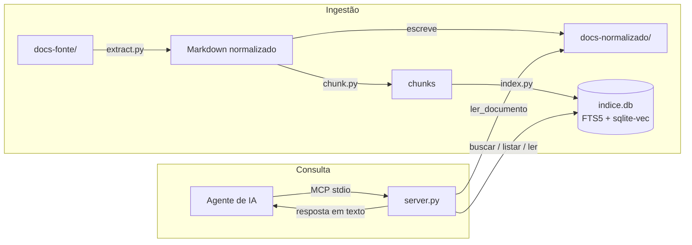

# Arquitetura

## Visão geral

## Decisões e o porquê

### SQLite FTS5 em vez de um banco vetorial dedicado

Um banco vetorial (Chroma, Qdrant, FAISS) resolveria só metade do problema —
a busca por vocabulário natural — e deixaria a busca por termo técnico exato
(nome de variável, endpoint, coluna) pior do que um BM25 simples. SQLite FTS5
já entrega BM25 de fábrica, sem subir nenhum serviço, e a extensão
`sqlite-vec` adiciona a camada vetorial **no mesmo arquivo**, sem introduzir
um segundo banco. Um projeto de documentação de "centenas de arquivos" não
justifica a complexidade operacional de um banco dedicado.

### Normalizar tudo para Markdown antes de indexar

Em vez de extrair texto direto de cada formato para dentro do índice, o
pipeline grava um Markdown intermediário em `docs-normalizado/`. Isso separa
dois problemas que, misturados, são difíceis de depurar juntos: "a extração
saiu ruim" vs. "a busca não encontrou o trecho certo". Também dá a uma
pessoa (não só ao agente) um jeito de ler a documentação diretamente.

### Reindexação completa, não incremental

Com centenas de arquivos a reindexação completa leva segundos. Indexação
incremental (detectar o que mudou, atualizar só isso) é uma otimização real,
mas prematura aqui — o custo de manter dois caminhos de indexação (completo e
incremental) sincronizados supera o tempo que ela economizaria neste estágio.

### Busca híbrida com Reciprocal Rank Fusion (RRF)

BM25 e similaridade de cosseno vivem em escalas numéricas diferentes;
somar ou normalizar os dois scores diretamente é uma fonte constante de bugs
sutis (um dos dois passa a dominar dependendo da distribuição de valores).
RRF usa apenas a **posição** de cada resultado em cada lista, então o
problema desaparece — o preço é não conseguir combinar os scores brutos,
o que não importa aqui porque o consumidor final é um agente de IA lendo
texto, não um sistema que precisa do score exato.

### Transporte stdio primeiro, não HTTP

stdio é o transporte mais simples do protocolo MCP: o cliente sobe o
processo do servidor diretamente, sem porta, sem autenticação, sem TLS. Para
uso local — um desenvolvedor, ou uma VM/Codespace dedicada a um agente — isso
é suficiente e elimina uma classe inteira de configuração. HTTP com OAuth só
se justifica quando múltiplos usuários ou serviços remotos precisam
compartilhar o mesmo servidor (ver "Fase futura" abaixo).

### Modelo de embeddings local, sem API

Nenhuma chamada de rede em tempo de busca é um requisito, não uma
preferência: documentação interna pode conter segredos, nomes de clientes,
detalhes de infraestrutura. `intfloat/multilingual-e5-small` roda em CPU,
tem ~470MB, e tem bom desempenho em português — trade-off aceitável para não
depender de uma API externa nem de GPU.

## Fase futura

Deliberadamente fora de escopo nesta versão (ver seção 12 do plano original):

- **Reranking com cross-encoder** — o próximo upgrade de qualidade de busca depois do híbrido.
- **Expansão de consulta / perguntas sintéticas** — para melhorar recall em corpora grandes.
- **Transporte HTTP com OAuth** — para servir múltiplos usuários/serviços remotos.
- **Permissão por documento** — hoje qualquer agente conectado vê toda a documentação.
- **Interface web** — hoje a única forma de leitura humana é o Markdown normalizado em disco.
- **Reindexação automática via CI ou watcher de arquivos** — hoje `docserver ingest` é manual.
- **OCR para PDF escaneado** — hoje esses arquivos só são marcados como "suspeitos" no relatório.
- **Integração direta com Confluence, Google Drive, Notion** — hoje a entrada é sempre `docs-fonte/`.

## Avaliação de qualidade de busca

O conjunto de perguntas em `avaliacao/perguntas.yaml` mede, por perfil
(`tecnico` / `natural`), se o documento esperado aparece no top-5 de cada
modo de busca. No corpus de demonstração incluído neste repositório (poucos
documentos, vocabulário próximo entre pergunta e resposta) os três modos
empatam em 100% — o corpus é pequeno demais para expor a diferença que a
busca híbrida existe para resolver. O ganho da camada vetorial fica visível
em corpora reais, maiores e com vocabulário mais distante entre a pergunta
de negócio e o texto técnico do documento. Ao adotar este projeto, substitua
o conteúdo de `docs-fonte/` e as perguntas de `avaliacao/perguntas.yaml`
pelos do seu próprio projeto e rode `docserver avaliar` de novo.
