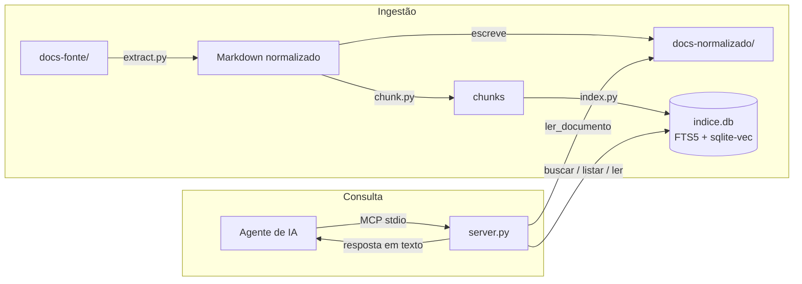

# Arquitetura

## Visão geral

## Decisões e o porquê

### SQLite FTS5 em vez de um banco vetorial dedicado

Um banco vetorial (Chroma, Qdrant, FAISS) resolveria só metade do problema —
a busca por vocabulário natural — e deixaria a busca por termo técnico exato
(nome de variável, endpoint, coluna) pior do que um BM25 simples. SQLite FTS5
já entrega BM25 de fábrica, sem subir nenhum serviço, e a extensão
`sqlite-vec` adiciona a camada vetorial **no mesmo arquivo**, sem introduzir
um segundo banco. Um projeto de documentação de "centenas de arquivos" não
justifica a complexidade operacional de um banco dedicado.

### Normalizar tudo para Markdown antes de indexar

Em vez de extrair texto direto de cada formato para dentro do índice, o
pipeline grava um Markdown intermediário em `docs-normalizado/`. Isso separa
dois problemas que, misturados, são difíceis de depurar juntos: "a extração
saiu ruim" vs. "a busca não encontrou o trecho certo". Também dá a uma
pessoa (não só ao agente) um jeito de ler a documentação diretamente.

### Reindexação completa, não incremental

Com centenas de arquivos a reindexação completa leva segundos. Indexação
incremental (detectar o que mudou, atualizar só isso) é uma otimização real,
mas prematura aqui — o custo de manter dois caminhos de indexação (completo e
incremental) sincronizados supera o tempo que ela economizaria neste estágio.

### Busca híbrida com Reciprocal Rank Fusion (RRF)

BM25 e similaridade de cosseno vivem em escalas numéricas diferentes;
somar ou normalizar os dois scores diretamente é uma fonte constante de bugs
sutis (um dos dois passa a dominar dependendo da distribuição de valores).
RRF usa apenas a **posição** de cada resultado em cada lista, então o
problema desaparece — o preço é não conseguir combinar os scores brutos,
o que não importa aqui porque o consumidor final é um agente de IA lendo
texto, não um sistema que precisa do score exato.

RRF por si só sempre devolve `limite` resultados, mesmo quando nada no índice
é de fato relevante — ele só sabe *ordenar*, não sabe dizer "nada aqui serve".
Com dois documentos de vocabulário parecido no mesmo índice (dois PDFs
institucionais, por exemplo), isso mistura trechos de um documento na
resposta sobre o outro, sem nenhum sinal de que algo deu errado. Por isso
`buscar_hibrido` aplica um corte de relevância depois do RRF: um resultado só
sobrevive se apareceu na lista léxica **e** cobre pelo menos
`COBERTURA_LEXICA_MINIMA` (variável de ambiente, padrão 0.5) do peso IDF dos
termos da consulta, ou se a similaridade de cosseno (calculada a partir da
distância L2 do índice vetorial, com os embeddings normalizados) passar de
`SIMILARIDADE_MINIMA` (variável de ambiente, padrão 0.85). O mesmo corte vale
quando não há índice vetorial (fallback BM25). Sem ele, uma busca híbrida
"bem-sucedida" e uma busca que só achou lixo são indistinguíveis do lado do
agente.

A cobertura é ponderada por IDF (a mesma fórmula do BM25, calculada no escopo
da busca), e termos que não aparecem em nenhum chunk saem do denominador. As
duas versões anteriores falhavam em sentidos opostos:

- **Contar termos sem peso** (≥50% dos termos no chunk) descartava acertos
  legítimos: "como funciona a paginação dos endpoints" acerta a seção
  "Paginação", que não contém "endpoints". Com IDF, "endpoints" não existe no
  corpus e não pesa; "paginação" sozinho cobre 100%.
- **Aceitar qualquer item da lista léxica** deixava passar ruído, porque a
  query FTS5 usa `OR`: "rate limit da API" trazia trechos do livro que só
  mencionam "API". Com IDF, "API" (termo comum) vale uma fração pequena do
  peso, e um chunk que só tem ele fica bem abaixo de 0.5.

O padrão de 0.85 foi calibrado empiricamente contra o corpus real deste
projeto (relatório de Niterói + calendário acadêmico + docs de exemplo): o
`multilingual-e5-small` comprime a maioria das similaridades entre 0.7 e 0.9,
a ponto de uma consulta sem nenhuma relação com o corpus (ex.: "receita de
bolo") ainda alcançar 0.83-0.85 de similaridade só por semelhança superficial
de registro/formalidade do texto — um corte em 0.80 (valor inicial deste
projeto) deixava esse ruído passar. Consultas genuinamente respondidas pelo
corpus ficaram na faixa 0.87-0.90. Se o seu corpus for muito diferente
(vocabulário mais técnico, ou mais uniforme entre documentos), recalibre:
rode consultas conhecidas (relacionadas e não relacionadas) direto contra
`index.buscar_vetorial`, observe a distância entre as duas faixas de
similaridade, e ajuste `SIMILARIDADE_MINIMA` via variável de ambiente.

Consultas em linguagem natural também levam ruído: "qual o objetivo do
projeto" tem três palavras (`qual`, `o`, `do`) que combinam com quase
qualquer chunk via `OR` na query FTS5, sem carregar nenhum significado —
`_termos_uteis` remove esse tipo de stopword antes de montar a query léxica —
sem isso, praticamente qualquer chunk "casaria" via essas palavras e o corte
de relevância baseado na lista léxica perderia o sentido.

### Filtro por documento na busca (`documento` em `buscar`)

Quando o agente já sabe qual documento tem a resposta (por `listar_documentos`
ou por uma busca anterior), ele pode restringir a busca a esse documento com
o parâmetro `documento`. Isso é mais forte que qualquer corte de relevância
genérico: com dois PDFs sobre assuntos completamente diferentes mas de
vocabulário formal parecido, uma busca vetorial pode achar o documento errado
"relevante o bastante" mesmo com o corte de similaridade ativo. Restringir
por documento elimina essa classe de erro por construção, em vez de tentar
compensá-la com um corte estatístico melhor.

`index.resolver_origem` casa um caminho parcial (ou só o nome do arquivo)
contra os `caminho_origem` distintos no índice, com o mesmo espírito da
resolução de caminho de `ler_documento`: exato, por sufixo, ou pelo nome do
arquivo — sem exigir que o agente acerte o caminho completo de primeira.

### Transporte stdio primeiro, não HTTP

stdio é o transporte mais simples do protocolo MCP: o cliente sobe o
processo do servidor diretamente, sem porta, sem autenticação, sem TLS. Para
uso local — um desenvolvedor, ou uma VM/Codespace dedicada a um agente — isso
é suficiente e elimina uma classe inteira de configuração. É também por isso
que `docserver serve` sozinho nunca produz um link: stdio não tem rede, o
processo só fala pelos streams padrão de quem o subiu.

`docserver serve --http` liga o transporte HTTP nativo do `fastmcp`
(`mcp.run(transport="http", host=..., port=...)`), que expõe um endpoint
real (`http://host:porta/mcp`) — necessário para um cliente MCP remoto, para
inspecionar com `curl`/MCP Inspector, ou para servir mais de um cliente ao
mesmo tempo. Não veio como padrão porque ele reintroduz a superfície que
stdio evita de propósito — porta, bind de rede, e nenhuma autenticação
própria (ver `docs/AGENTES.md` para como usar com segurança). HTTP com OAuth
propriamente dito só se justifica quando múltiplos usuários ou serviços
remotos precisam compartilhar o mesmo servidor pela rede (ver "Fase futura"
abaixo) — `--http` cobre o caso mais simples de "preciso de um link", não
esse.

### Modelo de embeddings local, sem API

Nenhuma chamada de rede em tempo de busca é um requisito, não uma
preferência: documentação interna pode conter segredos, nomes de clientes,
detalhes de infraestrutura. `intfloat/multilingual-e5-small` roda em CPU,
tem ~470MB, e tem bom desempenho em português — trade-off aceitável para não
depender de uma API externa nem de GPU. Os embeddings são normalizados
(`normalize_embeddings=True`) para que a distância L2 devolvida pelo
`sqlite-vec` possa virar similaridade de cosseno com uma fórmula fechada
(`sim = 1 - distância²/2`), sem precisar de uma segunda consulta só para
normalizar depois.

O modelo é carregado **no startup do `docserver serve`**, antes de aceitar
requisições (`server._aquecer`), e não na primeira busca: o import de torch +
pesos levava mais de 120 s e segurava na fila as chamadas que chegassem nesse
meio-tempo — o cliente MCP chegava a desistir da primeira busca. Com o modelo
em cache local, o carregamento não consulta o Hugging Face Hub. O servidor
também mantém uma única conexão SQLite por processo (protegida por lock) em vez
de abrir uma por tool call. `serve --sem-aquecimento` volta ao carregamento
preguiçoso (startup rápido, primeira busca lenta); uma falha no aquecimento só
é registrada em stderr e o servidor sobe mesmo assim.

### Chunks limitados pelo tamanho real de tokens, não por uma estimativa de caracteres

`multilingual-e5-small` trunca silenciosamente qualquer texto acima de 512
tokens — o excesso simplesmente não entra no vetor, sem erro nem aviso. Um
chunk de PDF mal dividido pode passar de 1500 tokens reais mesmo cabendo na
estimativa ingênua de "4 caracteres por token" (que em português, e
principalmente em tabelas, é otimista demais). `chunk.py` conta tokens com o
tokenizer real do modelo (`contar_tokens`, com fallback para uma estimativa
mais conservadora — 1 token a cada 3 caracteres — quando o modelo não está
em cache local) e nunca deixa um chunk passar de `MAX_TOKENS_CHUNK` (400,
com margem para o prefixo `passage:`/`query:` e para título+seção que entram
no texto embeddado). A quebra tenta parágrafo, depois linha, depois frase, e
só corta no meio de uma palavra como último recurso.

Cabeçalhos de nível 1 a 3 (`#`, `##`, `###`) delimitam seções — não só `##`
como antes — porque extratores de PDF (`pymupdf4llm`) geram níveis variados
dependendo do tamanho de fonte detectado no documento original, e um
calendário ou relatório inteiro virando "uma seção só" perde toda a
granularidade que a busca por seção depende.

### `listar_documentos` e `ler_documento` nunca servem o que não está no índice

Ambos leem o índice (`indice.db`), não o disco, para decidir o que existe.
`ler_documento` resolve o caminho pedido (de origem ou normalizado, completo,
parcial ou só o nome) contra o índice e só então lê
`<--docs-normalizado>/<caminho_normalizado>` — o índice guarda esse caminho
relativo e em formato POSIX justamente para funcionar com ingestão e servidor
em diretórios diferentes. Um
`.md` que sobrou em `docs-normalizado/` de uma ingestão anterior — porque o
arquivo original em `docs-fonte/` foi apagado ou renomeado depois — não é
mais gerado nem listado, mesmo que o arquivo continue fisicamente ali (a
ingestão o remove automaticamente, ver `docs/INGESTAO.md`, mas até essa
limpeza rodar, a MCP tool não confia num `.md` que a última ingestão não
tocou). Foi exatamente esse cenário — um documento apagado da fonte, mas
ainda presente em `docs-normalizado/` de uma ingestão anterior — que causou
uma busca sobre um documento devolver trechos de outro completamente
diferente.

### Watcher como processo separado, disparando a ingestão completa

`docserver watch` (`src/docserver/watch.py`) observa `docs-fonte/` com o
`watchdog`, agrupa os eventos por alguns segundos e chama o mesmo
`executar_ingestao` do `docserver ingest`. Não existe caminho de indexação
novo: todas as proteções e a remoção de órfãos valem igual, e a decisão de
reindexação completa continua de pé.

Ele roda num processo próprio, e não como thread do servidor MCP, por três
motivos: no transporte stdio o stdout é o canal do protocolo e não pode receber
relatórios; o cálculo de embeddings de uma ingestão não disputa CPU e GIL com as
buscas; e uma falha no watcher não derruba o servidor. A consistência entre os
dois processos vem do SQLite: a troca dos chunks é uma única transação.

### Índice em modo WAL

`index.criar_indice` liga `PRAGMA journal_mode=WAL` e abre a conexão com
timeout de 30 s. Com o journal padrão, enquanto a ingestão (outro processo)
confirmava a transação final, as leituras do servidor ficavam bloqueadas, e
uma busca que esperasse mais que o timeout falhava com `database is locked`.
Em WAL, os leitores continuam vendo o índice anterior até o commit e passam a
ver o novo na consulta seguinte.

Consequências: ao lado de `data/indice.db` aparecem `indice.db-wal` e
`indice.db-shm` enquanto há conexões abertas (já cobertos pelo `.gitignore` de
`data/`), e o arquivo não deve ficar numa pasta de rede (NFS/SMB), onde o SQLite
não garante a memória compartilhada do WAL. Para copiar o índice, pare servidor
e ingestão antes, ou copie os três arquivos juntos.

## Fase futura

Deliberadamente fora de escopo nesta versão (ver seção 12 do plano original):

- **Reranking com cross-encoder** — o próximo upgrade de qualidade de busca depois do híbrido.
- **Expansão de consulta / perguntas sintéticas** — para melhorar recall em corpora grandes.
- **Transporte HTTP com OAuth** — para servir múltiplos usuários/serviços remotos.
- **Permissão por documento** — hoje qualquer agente conectado vê toda a documentação.
- **Interface web** — hoje a única forma de leitura humana é o Markdown normalizado em disco.
- **Reindexação automática via CI** — o watcher local (`docserver watch`) já existe; falta disparar a ingestão a partir de um pipeline.
- **Watcher garantido em Linux** — modo polling para Docker/WSL2/rede e execução como serviço (ver `docs/INGESTAO.md`).
- **OCR para PDF escaneado** — hoje esses arquivos só são marcados como "suspeitos" no relatório.
- **Integração direta com Confluence, Google Drive, Notion** — hoje a entrada é sempre `docs-fonte/`.

## Avaliação de qualidade de busca

O conjunto de perguntas em `avaliacao/perguntas.yaml` mede, por perfil
(`tecnico` / `natural`), se o documento esperado aparece no top-5 de cada
modo de busca. Rodando só contra o corpus de demonstração deste repositório
(poucos documentos, vocabulário próximo entre pergunta e resposta), os três
modos empatam em 100% — pequeno demais para expor a diferença que a busca
híbrida existe para resolver. Com o corpus real deste projeto (relatório de
Niterói e calendário acadêmico somados ao corpus de demonstração, 169
chunks), a diferença aparece: `lexico` e `hibrido` mantêm 100% nos dois
perfis, mas `vetorial` puro cai para 9/10 no perfil técnico — um termo curto
como "Retry-After" tem pouco significado semântico para o embedding sozinho,
e sem o apoio do BM25 (que casa o termo exato) ou o corte de relevância
(que só existe em `buscar_hibrido`) a busca vetorial pura erra. Por isso
`hibrido`, não `vetorial`, é o modo recomendado para uso real — o ganho da
camada vetorial aparece embutido nele, sem herdar essa fraqueza isolada. Ao
adotar este projeto, substitua o conteúdo de `docs-fonte/` e as perguntas de
`avaliacao/perguntas.yaml` pelos do seu próprio projeto e rode
`docserver avaliar` de novo.
